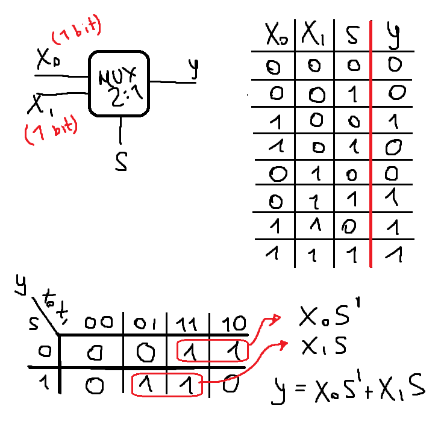
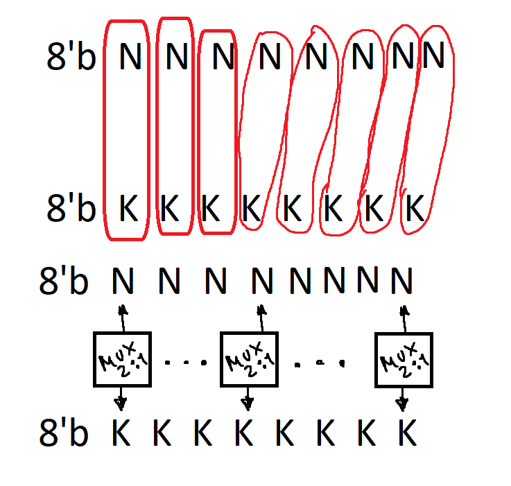
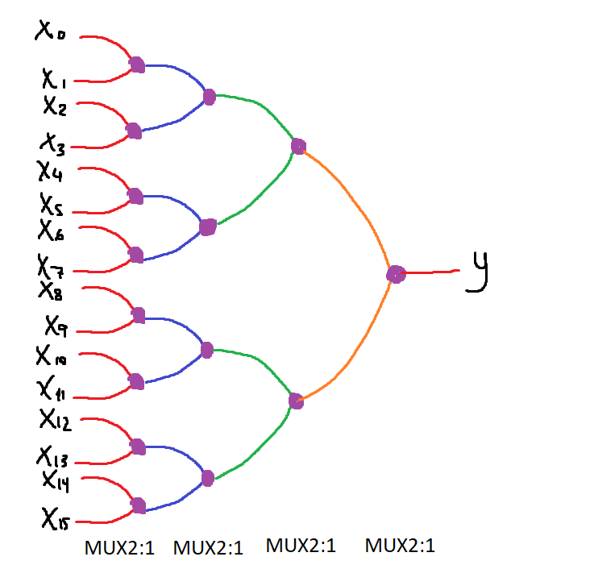
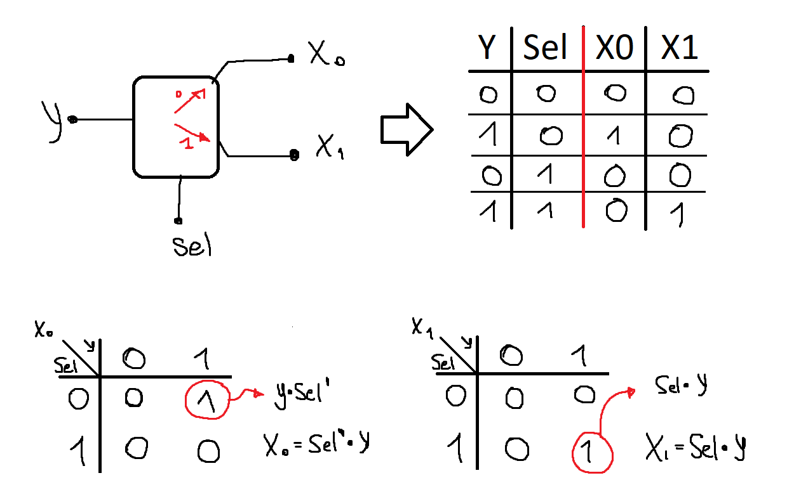
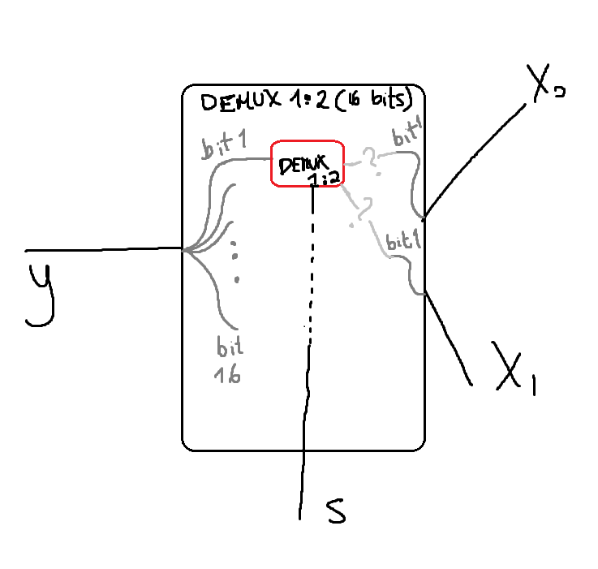
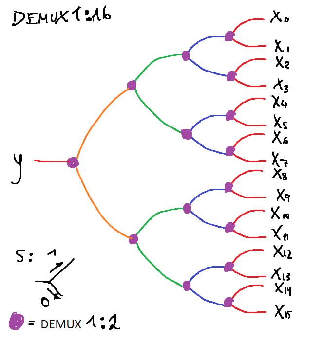
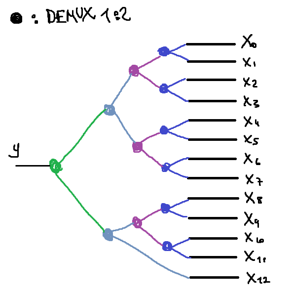
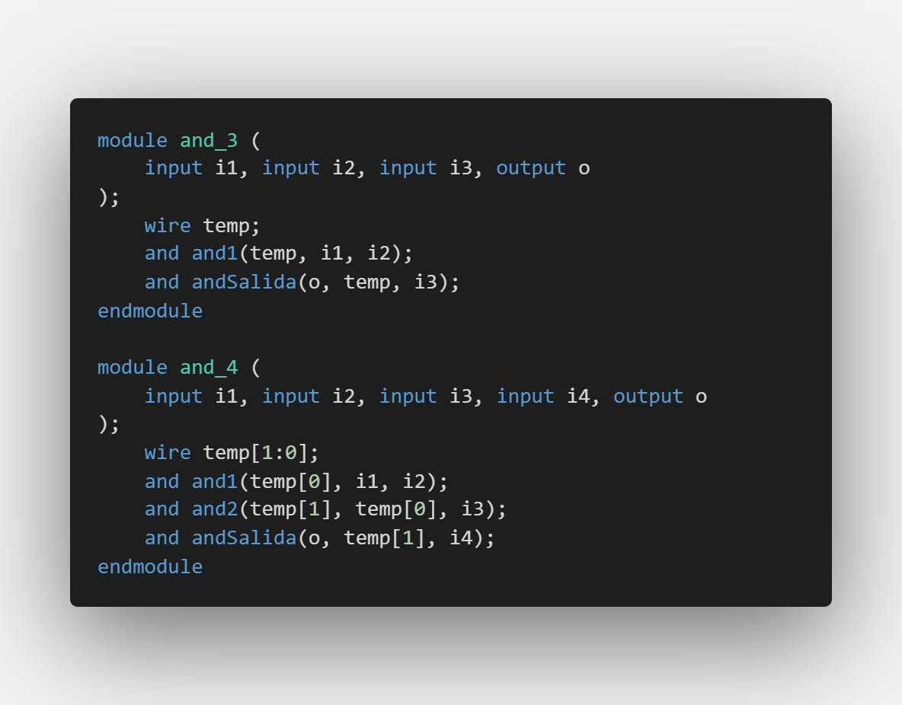
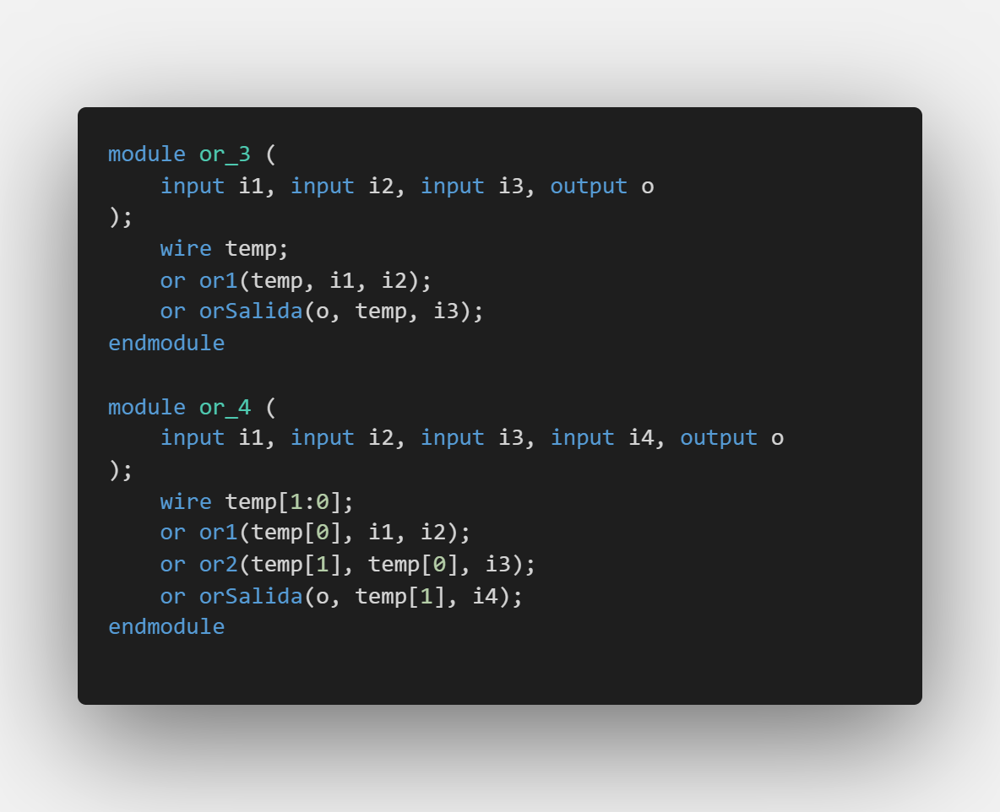

# Laboratorio Nro 1 - ARCH
## Justificación problema 1
### Planteamiento
En primer lugar, debemos crear un modulo para representar el MUX2:1. Creamos una tabla con las entradas y salidas para luego generar el mapa de Karnaugh, retornandonos la expresión más reducida. Este MUX está encargado de evaluar dos entradas de 1 bit.

Con el propósito de que el MUX evalúe entradas de 8 bits (bus [7:0]), debemos crear un nuevo módulo que use los MUX2:1 de 1 bit para evaluar cada bit de las dos entradas por su extensión de 8 bits.

Si tratasemos de crear un MUX16:1 usando solo MUX2:1, podemos ver los MUX2:1 como nodos donde se originan decisiones dentro de un árbol que tiene varias ramas (16).

Con respecto a los selectores de los 15 MUX2:1 utilizados debemos platearnos lo siguiente. Si queremos que se retorne la rama X7, seguimos las decisiones a tomar en el arbol.
 
1. En la primera columna-nodo podemos utilizar solo 1 parámetro de selector ya que no es relevante la rama escogida en los otros pares de entradas.
2. En la segunda columna-noda utilizamos únicamente 1 solo parámetro diferente utilizando la misma justifiación que en 1.
3. Tomando en cuenta la irrelevancia de los selectores de los MUX2:1 que no contengan la rama a retornar, nos limitaremos únicamente a 4 estados de selectores. (4 bits individuales)

Tomando esto en cuenta, creamos el modulo de MUX16:1 evaluando lo presentado en el árbol de deciones. Cabe recalcar que únicamente este módulo soporta entradas de 8 bits.

### Fase de pruebas (*testbench*)

---

## Justificación problema 2
## PARTE A

Planteamos el funcionamiento del DEMUX1:2 como un modulo capaz de enviar una señal de entrada únicamente por una sola de sus dos salidas por medio de un selector. Teniendo esto en cuenta, generamos una tabla con todas las salidas y entradas para obtener el K-map y la expresión para determinar el estado de cada una de sus salidas.

Similar al ejercicio anterior, debemos crear un módulo capaz de aceptar entradas con entradas de 16 bits. Para diseñarlo se utilizará la idea del anterior ejercicio la cual era evaluar un bit a la vez durante el transcurso de sus 16 bits. 

Utilizando lo visto previamente, ahora se aplicará el concepto de árbol de decisiones pero aplicado inversamente. 

Con respecto al manejo de entradas *seleccion*, nos planteamos un ejemplo de querer retornar la entrada mediante la rama **X4**. La seleccion del primer, segundo, tercero y cuarto DEMUX1:2 tendrá los valores 1,0,1,1 respectivamente. Nos percatamos de que si aplicasemos aquellos estados en los DEMUX restantes de cada columna, la salida objetivo se vería alterada. Por lo que para evitar redundancia, se diseñara aquel DEMUX1:16 teniendo solamente con 4 valores de seleccion.

### Fase de pruebas (*testbench*)

## PARTE B

Un DEMUX de 13 salidas puede crearse utilizando únicamente DEMUX1:2, no obstante, el diseño del árbol de decisiones no sería simétrico al no ser una potencia de 2. Dos entradas de selección quedarían inutilizadas para seleccionar una salidas que quedaría sobrante al agrupar todo en parejas utilizando el DEMUX1:2. No obstante, el número de entradas de selección no cambiaría ya que la rama sobrante funciona una salida para uno de los DEMUX de la segunda columna-nodo.

---

## Justificación problema 3

Debemos crear mapas de Karnaugh con respecto a los resultados de "mayor a", "menor a" e "igual".

**Caso AB>CD (F3)**

Armamos y resolvemos el K-Map, asegurandonos que la última expersión hallada tenga la menor cantidad de operaciones posibles.

**Caso AB<CD (F2)**

Armamos y resolvemos el K-Map, asegurandonos que la última expersión hallada tenga la menor cantidad de operaciones posibles.

**Caso AB=CD (F1)**

Armamos y resolvemos el K-Map, asegurandonos que la última expersión hallada tenga la menor cantidad de operaciones posibles.

Como son términos adyacentes diagonales, no es posible reducir más la expresión hallada.

Con el objetivo de hacerlo estructuralmente, nos damos cuenta que hay múltiples fragmentos donde existen compuertas AND y OR de 3 y 4 entradas. Evitando el desorden del código, se crean módulos AND y OR que acepten 3 y 4 entradas. 

Utilizando estos nuevos módulos lógicos, se crea un módulo para AB > CD, AB = CD y AB < CD. Finalmente, se ensambla el modulo comparador que dará las respectivas salidas F1, F2 y F3. (Como observación es posible no crear un módulo para = si > y < ya estan creados. Solo basta con saber que ambos tienen un estado 0 para determinar que = será 1 utilizando el módulo NOR). 

---

## Justificación problema 4

Para resolver los mapas de Karnaugh formados a partir de las tablas presentadas, debemos aprovechar las casillas marcadas sin interés con el propóito de conseguir expresiones más cortas.

