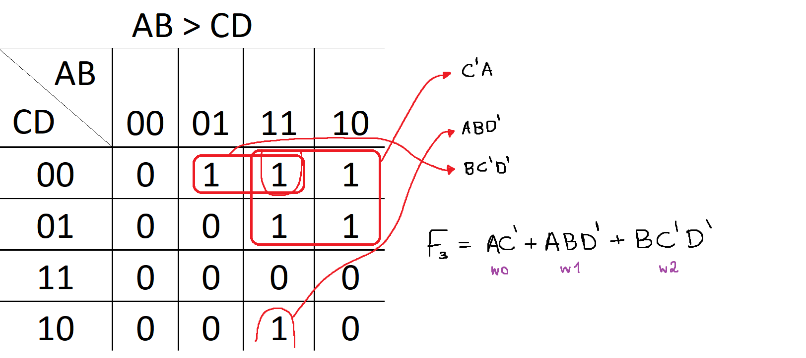
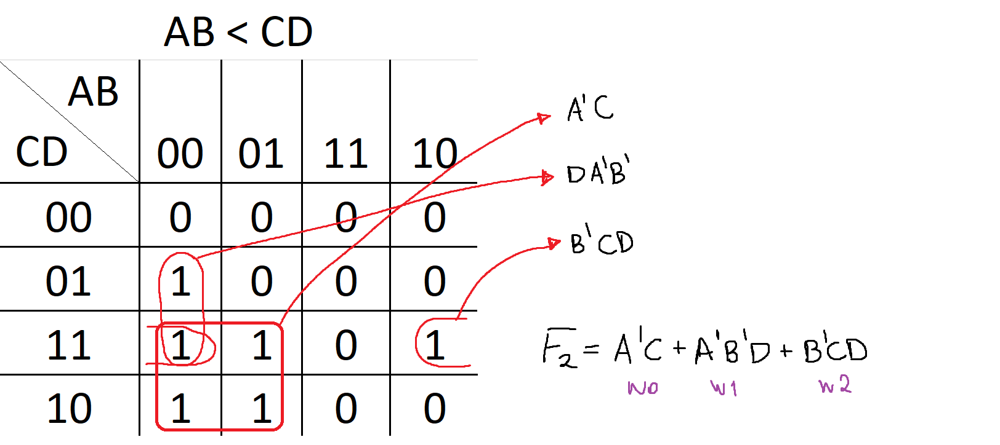
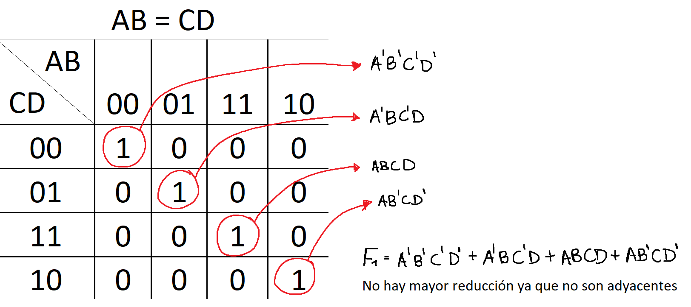

## Justificación problema 3

Debemos crear mapas de Karnaugh con respecto a los resultados de "mayor a", "menor a" e "igual".

**Caso AB>CD (F3)**

Armamos y resolvemos el K-Map, asegurandonos que la última expersión hallada tenga la menor cantidad de operaciones posibles.

**Caso AB<CD (F2)**

Armamos y resolvemos el K-Map, asegurandonos que la última expersión hallada tenga la menor cantidad de operaciones posibles.

**Caso AB=CD (F1)**

Armamos y resolvemos el K-Map, asegurandonos que la última expersión hallada tenga la menor cantidad de operaciones posibles.

## Resolución estructural

Para cada expresion *Fn* debemos crear un módulo que evalúe los 4 bits ingresados. 
